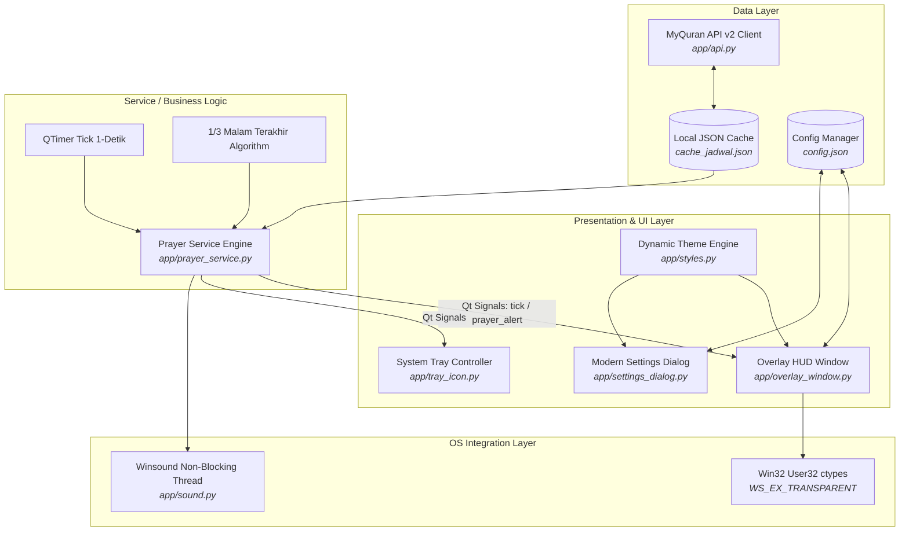

<div align="center">

# 🕌⚡ AuraSalat Desktop Overlay (ASDO)
### *A Lightweight, Non-Intrusive Windows Desktop HUD for Muslim Developers & Gamers*

[](https://github.com)
[](https://www.python.org/)
[](https://riverbankcomputing.com/software/pyqt/)
[](https://github.com/catppuccin/catppuccin)
[](LICENSE)
[](https://github.com)

[📥 Download Installer (.exe)](#-download--instalasi) • [✨ Fitur Utama](#-fitur-utama) • [🏗️ Arsitektur Sistem](#️-arsitektur--engineering-highlights) • [🚀 Cara Menjalankan](#-quick-start-development) • [⚙️ Konfigurasi](#️-skema-konfigurasi)

</div>

---

## 📌 Latar Belakang & Motivasi Proyek (Problem Statement)

Sebagai software engineer, gamer, dan kreator digital, kita sering kali mengalami **deep focus** atau *flow state* di depan monitor berjam-jam. Sayangnya, hal ini kerap membuat kita terlena dan melewatkan waktu salat fardu maupun sepertiga malam terakhir (*Tahajjud*).

Aplikasi pengingat salat yang ada saat ini umumnya memiliki kendala:
1. **Terlalu Intrusif / Menutupi Layar**: Jendela besar yang menghalangi kode program di IDE atau mengganggu sesi gaming.
2. **Berbasis Web / Smartphone**: Membutuhkan tab browser aktif yang memakan RAM atau harus mengecek smartphone yang justru memecah konsentrasi kerja.
3. **Desain Kuno & Kaku**: Jarang yang mengadopsi estetika modern *developer-friendly* (seperti palet warna Catppuccin, Glassmorphism, atau hardware monitor HUD ala MSI Afterburner).

**AuraSalat Desktop Overlay (ASDO)** diciptakan sebagai solusi elegan: widget desktop native yang ultra-ringan, transparan, estetis, dan fleksibel—bisa ditempel di wallpaper desktop tanpa menghalangi jendela kerja sama sekali, atau dijadikan HUD floating yang tembus klik mouse.

---

## ✨ Fitur Unggulan (Key Features)

### 1. 🖥️ Fleksibilitas Tampilan: Desktop Layer vs Always-on-Top
- **Mode Wallpaper Desktop (`WindowStaysOnBottomHint`)**: Widget menempel di wallpaper desktop Windows dan berada di bawah semua jendela aktif (VS Code, Chrome, Game). Anda tetap dapat melihat jadwal salat secara sekilas (*glanceable*) tanpa terganggu.
- **Mode Always-on-Top (`WindowStaysOnTopHint`)**: Widget mengapung di atas semua aplikasi.
- **Toggle Instan**: Cukup klik ikon `🖥 / 📌` pada header widget untuk beralih mode layer secara instan.

### 2. ↕️ Mode Ringkas (Compact Mini Bar)
- Sembunyikan kartu jadwal salat lengkap dan ubah widget menjadi **satu baris ramping horizontal** (`NEXT: MAGHRIB 00:10:14 | 1/3 Malam: 00:33`).
- Sangat ideal diletakkan di pojok atas monitor ultrawide atau di atas taskbar sekunder.
- Shortcut: Tekan tombol **F8** atau klik tombol `↕` pada header.

### 3. 🌙 Perhitungan Otomatis 1/3 Malam Terakhir (Waktu Tahajjud)
- Menghitung secara astronomis waktu mulainya **Sepertiga Malam Terakhir** berdasarkan interval waktu Maghrib dan Subuh hari tersebut:
  $$\text{Waktu Mulai} = \text{Subuh} - \frac{1}{3} \times (\text{Subuh} - \text{Maghrib})$$
- Menampilkan rentang waktu Tahajjud (contoh: `00:33 - 04:05 WIB`).
- Status bar dan kartu otomatis memancarkan highlight hijau lembut saat waktu 1/3 malam sedang berlangsung.

### 4. 🎨 Tema Estetis Catppuccin & Cyber HUD
- **Catppuccin Collection**:
  - `Catppuccin Mocha` (Default - Soft pastel dark: Mauve, Lavender, Peach, Surface)
  - `Catppuccin Macchiato` (Warm pastel dark)
  - `Catppuccin Latte` (Clean elegant light theme)
- **Cyber HUD / Hardware Monitor**:
  - `Cyber Cyan` (Neon cyberpunk blue)
  - `MSI Amber` (Tactical hardware monitor orange)
  - `Emerald Matrix` (Islamic Cyber Mint Green)
  - `Stealth Crimson` (Stealth Rogue Red)
- Pengaturan transparansi dinamis (*Opacity Slider* 40% – 100%).

### 5. 🔒 Click-Through Mode (Tembus Mouse via Win32 API)
- Menggunakan integrasi Windows API `ctypes.windll.user32` dengan flag `WS_EX_TRANSPARENT`.
- Mouse dapat mengklik objek di belakang widget tanpa sengaja menekan widget saat bermain game atau mengetik cepat.
- Kunci / buka kunci via shortcut **F9** atau ikon **System Tray**.

### 6. 🇮🇩 Integrasi Data Resmi Kemenag RI & Offline-First
- Terintegrasi dengan **MyQuran API v2** (data resmi Kementerian Agama Republik Indonesia).
- **Default Wilayah: Kab. Jombang, Jawa Timur** (dapat diubah ke 518 kota/kabupaten lain di Indonesia melalui fitur pencarian interaktif).
- **Offline Caching**: Data disimpan secara lokal di `cache_jadwal.json` & `cache_cities.json`. Aplikasi tetap berjalan 100% normal tanpa koneksi internet.
- **Auto-Sync Harian**: Otomatis memperbarui jadwal saat pergantian hari (pukul 00:00).

### 7. 🔔 Sistem Notifikasi Ringan & Santun
- **Visual Alert**: Animasi berkedip halus (*pulsing alert*) pada kartu salat yang sedang masuk waktunya.
- **Gentle Sound Chime**: Nada dering 3-nada santun non-blocking via `winsound` (bebas lag dan bisa di-mute).
- **Windows System Notification**: Balon notifikasi asli Windows Taskbar.

---

## 🏗️ Arsitektur & Engineering Highlights

Proyek ini dibangun dengan menerapkan prinsip **Clean Architecture**, **Separation of Concerns (SoC)**, dan **Event-Driven Programming** menggunakan Qt Signals & Slots.



### 💡 Poin Kunci Rekayasa Perangkat Lunak (Software Engineering Feats):

1. **Ultra Low Resource Footprint**:
   - Penggunaan memori RAM stabil di kisaran **~25 - 35 MB**.
   - Beban CPU **< 0.1%** berkat pemanfaatan event loop `QTimer` berbasis interval 1 detik tanpa *busy-waiting*.
2. **Win32 Hooking Tanpa Dependency Berat**:
   - Fitur click-through diimplementasikan langsung menggunakan library bawaan Python `ctypes` untuk memanipulasi *Extended Window Styles* (`GWL_EXSTYLE`, `WS_EX_TRANSPARENT`, `WS_EX_LAYERED`), menghindari dependensi pihak ketiga seperti `pywin32`.
3. **Resilience & Fault-Tolerance**:
   - Jika koneksi internet terputus, aplikasi beralih ke cache lokal.
   - Jika cache lokal belum ada, aplikasi menggunakan dataset fallback bawaan sehingga UI tidak pernah *crash* ataupun *blank*.
4. **Automated CI/CD & Windows Packaging**:
   - Single-executable packaging dengan **PyInstaller**.
   - Skrip otomasi kompilasi **Inno Setup 6** (`build_installer.py`) yang menghasilkan installer Windows profesional dengan desktop shortcut, start menu entry, dan clean uninstaller.
   - Pipeline **GitHub Actions** (`.github/workflows/build-release.yml`) untuk rilis otomatis saat pembuatan tag git.

---

## 📦 Struktur Direktori Proyek

```text
Pray-Tracker-Overlay/
├── .github/
│   └── workflows/
│       └── build-release.yml      # GitHub Actions CI/CD pipeline
├── app/
│   ├── __init__.py                # Package initialization
│   ├── api.py                     # MyQuran API v2 client & cache handler
│   ├── config.py                  # JSON persistent configuration manager
│   ├── overlay_window.py          # Frameless HUD & Mini-Bar Widget (PyQt6)
│   ├── prayer_service.py          # Countdown & 1/3 night calculation engine
│   ├── settings_dialog.py         # Modern interactive settings modal
│   ├── sound.py                   # Threaded Windows audio chime
│   ├── styles.py                  # QSS Design System (Catppuccin & HUD)
│   └── tray_icon.py               # Windows system tray controller & menu
├── assets/
│   ├── icon.ico                   # Windows application icon
│   └── icon.png                   # High-res application icon
├── dist/                          # Output builds
│   ├── AuraSalatOverlay-Setup-v1.0.0.exe  # Windows Setup Installer (~45MB)
│   └── AuraSalatOverlay.exe               # Standalone Portable EXE (~44MB)
├── .gitignore                     # Git ignore rules
├── build_exe.py                   # PyInstaller build automation
├── build_installer.py             # One-click PyInstaller + Inno Setup compiler
├── installer.iss                  # Inno Setup 6 packaging script
├── LICENSE                        # MIT License
├── main.py                        # Application entry point & Qt bootstrap
├── README.md                      # Project documentation & portfolio
└── requirements.txt               # Python package dependencies
```

---

## 🎮 Kontrol & Shortcut Cepat

| Tombol / Aksi | Shortcut | Deskripsi |
|---|:---:|---|
| **Drag & Drop** | Klik Kiri Tahan | Memindahkan posisi widget ke mana saja di layar monitor. Posisi otomatis tersimpan. |
| **Layer Switch** | Tombol `🖥 / 📌` | Beralih antara **Desktop Wallpaper Mode** (di bawah jendela) & **Always-on-Top**. |
| **Compact Mode** | `F8` atau `↕` | Mengecilkan widget menjadi satu baris horizontal ramping (*Mini Bar HUD*). |
| **Click-Through** | `F9` atau `🔒` | Mengunci widget agar tembus klik mouse (berguna saat bermain game). |
| **Settings Dialog** | `F10` atau `⚙` | Membuka jendela pengaturan kota, tema, transparansi, dan notifikasi. |
| **System Tray** | Klik Kanan Ikon Tray | Mengakses seluruh menu pengaturan, ubah kota, ganti tema, atau keluar aplikasi. |

---

## 📥 Download & Instalasi

### Untuk Pengguna Akhir (End Users)

Anda dapat langsung mengunduh file siap pakai tanpa perlu menginstall Python:

1. **Setup Installer (Direkomendasikan)**:
   - Unduh [**`AuraSalatOverlay-Setup-v1.0.0.exe`**](https://github.com) dari folder `dist/` atau menu [Releases](https://github.com).
   - Jalankan installer, ikuti petunjuk wizard instalasi, dan aplikasi akan terpasang di Start Menu & Desktop secara otomatis.
2. **Portable Executable**:
   - Unduh [**`AuraSalatOverlay.exe`**](https://github.com).
   - Simpan di folder mana saja dan langsung jalankan dengan double-click.

---

## 🚀 Quick Start (Development)

Bagi pengembang yang ingin menjalankan atau memodifikasi kode sumber:

### 1. Clone Repository
```bash
git clone https://github.com/USERNAME/Pray-Tracker-Overlay.git
cd Pray-Tracker-Overlay
```

### 2. Buat Virtual Environment & Install Dependensi
```powershell
python -m venv venv
.\venv\Scripts\activate
pip install -r requirements.txt
```

### 3. Jalankan Aplikasi
```powershell
python main.py
```

### 4. Build Installer Windows Sendiri
Pastikan Anda telah menginstal [Inno Setup 6](https://jrsoftware.org/isdl.php), lalu jalankan:
```powershell
python build_installer.py
```
File installer akan langsung terbentuk di folder `dist/`.

---

## ⚙️ Skema Konfigurasi (`config.json`)

Pengaturan aplikasi disimpan secara otomatis dalam format JSON:

```json
{
  "city_id": "1608",
  "city_name": "KAB. JOMBANG",
  "window_x": 100,
  "window_y": 100,
  "always_on_top": false,
  "window_layer": "desktop",
  "click_through": false,
  "sound_enabled": true,
  "theme": "catppuccin_mocha",
  "opacity": 0.94,
  "compact_mode": false,
  "show_imsak": false,
  "show_third_night": true
}
```

---

## 🛠️ Tech Stack & Libraries

- **Language**: Python 3.10+
- **GUI Framework**: PyQt6 (Qt 6.6+)
- **Design System & Styling**: Qt Style Sheets (QSS), Catppuccin Color Palette
- **HTTP Client & API**: Requests (MyQuran API v2 - Kementerian Agama RI)
- **Native OS APIs**: Win32 `ctypes` (`user32.dll`), `winsound`
- **Compiler & Packaging**: PyInstaller, Inno Setup 6
- **CI/CD Automation**: GitHub Actions (Windows Runner)

---

## 📄 Lisensi

Proyek ini dirilis di bawah lisensi [MIT License](LICENSE). Bebas digunakan, dipelajari, dan dikembangkan untuk keperluan non-komersial maupun komersial.

---

<div align="center">

**Dikembangkan dengan sepenuh hati sebagai proyek portofolio software engineering.**  
*AuraSalat Desktop Overlay (ASDO) — Keep Connected to Your Faith While Staying Focused.*

⭐ **Beri bintang (Star) pada repository ini jika proyek ini bermanfaat bagi Anda!** ⭐

</div>
